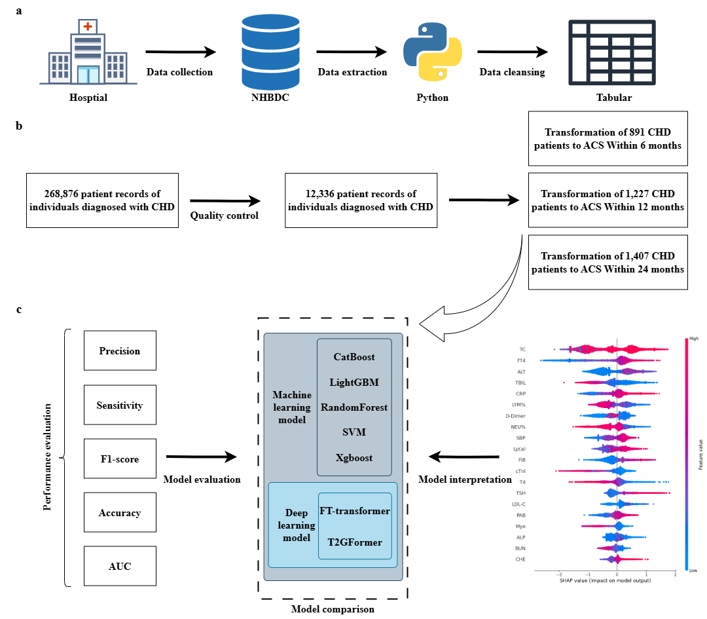

# Ai4CHD

## Introduction
Coronary heart disease (CHD), including its acute manifestation, acute coronary syndrome (ACS), continues to be a leading cause of morbidity and mortality worldwide. Early identification and differentiation of stable CHD, ACS, and normal individuals is critical for reducing the global burden of CHD. Traditional diagnostic methods often rely on invasive procedures or have limited accuracy in predicting disease progression. 

Ai4CHD is an AI-driven approach leveraging machine learning (ML) and deep learning (DL) techniques to analyze electronic health records (EHR) data, integrating clinical, demographic, and laboratory variables. The aim is to accurately distinguish between stable CHD, ACS, and healthy individuals, aiding early diagnosis and treatment.



## Features
AI models for diagnosing stable CHD, ACS, and healthy individuals.
EHR-based predictive analysis using structured clinical, demographic, and laboratory data.
Machine learning and deep learning models tailored for clinical decision support.
Scalable and adaptable to new datasets or healthcare systems.

## Installation
### Requirements
Python3.8

environments can be  `pip` install:

`pip install -r requirements.txt`

## Data availability: 
The data are not publicly available due to privacy and ethical restrictions. For the model, our online platform at https://chd.ai4tomorrow.online which will be under continuous development as we refine our model and add additional features.

## Usage
Machine Learning: 

Random Forest:

```python RF.py``` 

XGBoost

```python xgb.py``` 

SVM

```python SVM.py``` 

Deep Learning: 

ExcelFormer:

```python run_default_config_excel.py.py  --dataset test``` 

Ft-transformer:

```python ft-transformer.py``` 

T2g-Former：

```python run_t2g.py --dataset test``` 


# Example
For example, in Linux:
```
git clone https://github.com/HaozhongMa/Ai4CHD.git

cd Ai4CHD

pip install -r requirements.txt

cd T2g-Former

python run_t2g.py --dataset test 
```


